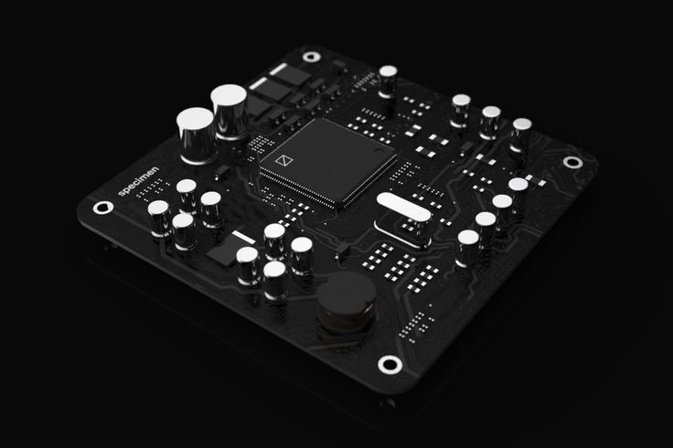

<h3 align="center">Embedded System Roadmap</h3>

# Curriculum

**Curriculum version**: `1.0.0`

- [Prerequisites](#prerequisites)
  - [Computer Science](#computer-science)
  - [Digital Design](#digital-design)
  - [Electronics](#electronics)
- [Introduction to Embedded Systems](#introduction-to-embedded-systems)
  - [Embedded Systems Concepts](#embedded-systems-concepts)
  - [Introduction to MCU Interfacing](#inroduction-to-microcontroller-interfacing)
- [In Depth Embedded Systems](#in-depth-embedded-systems)
  - [ARM MCUs Interfacing](#arm-mcus-interfacing)
- [Real Time OS](#real-time-os)
- [Autosar](#autosar)
- [Software Design](#software-design)

---

## Prerequisites

The Embedded Systems software engineer need to have solid knowledge of `CS`.

And a good background to `Digital Design` and `Electronics`.

## Computer Science

- [Intro to CS](#intro-to-cs)
- [The C Programming Language](#the-c-programming-language)
- [Data Structure and Algotithms](#data-structure-and-algotithms)
- [Problem Solving Mindset](#problem-solving-mindset)
- [Operating Systems](#operating-systems)
- [others](#others)

### Intro to CS

#### Study one of the following courses (CS50 is recommended)

- [CS50: Computer Science Courses and Programs from Harvard](https://www.edx.org/cs50) This course is the introduction to the world of computer science fields and Programming
- [Introduction to Computer Science and Programming in Python](https://ocw.mit.edu/courses/6-0001-introduction-to-computer-science-and-programming-in-python-fall-2016/) This course is a starting point to learn programming fundamentals in depth.

### The C Programming Language

#### Study the following books

- [C Programming A modern Approach](https://www.amazon.com/C-Programming-Modern-Approach-2nd/dp/0393979504) This book teach the C language. This play list is a good alternative [Neso Academy](https://www.youtube.com/watch?v=4OGMB4Fhh50&list=PLBlnK6fEyqRhX6r2uhhlubuF5QextdCSM)
- [Understanding and Using C Pointers](https://www.amazon.com/Understanding-Using-Pointers-Techniques-Management/dp/1449344186) This book introduces pointers specifically. (the most important topic in C programming)

#### Practice writing C programs on the following websites

- [Hacker Rank](https://www.hackerrank.com/)
- [IndiaBix](https://www.indiabix.com/)
- [San Foundry](https://www.sanfoundry.com/)

### Data Structure and Algotithms

#### Study the following book

- [Grokking Algorithms](https://www.amazon.com/Grokking-Algorithms-illustrated-programmers-curious/dp/1617292230) A great introduction to Algorithms and Data Structure.

#### Study one of the following cources of discrete mathematics (Dr Waleed is recommended)

Discrete Mathematics is not mandatory but it is better to study it independently rather than with the algorithms course.

- [MA 112: Discrete Mathematics I (logic, basics, and foundations)](https://github.com/DrWaleedAYousef/Teaching/tree/master/DiscreteMathematics) (Dr. Waleed)
- [Mathematics for Computer Science](https://ocw.mit.edu/courses/6-042j-mathematics-for-computer-science-fall-2010/)
- [Descrete Mathematics Neso-Academy](https://www.youtube.com/watch?v=p2b2Vb-cYCs&list=PLBlnK6fEyqRhqJPDXcvYlLfXPh37L89g3)

#### study the following Data Structure course

this course will give you what you need to implement the famous data structures in C.

- [CS 214: Data Structures](https://github.com/DrWaleedAYousef/Teaching/tree/master/DataStructures)

#### if you want to get advanced study one of the following courses

these course will change your mindset but these courses are not mendatory you can learn from problem solving.

- [Introduction to Algorithms](https://ocw.mit.edu/courses/6-006-introduction-to-algorithms-spring-2020/) An execlent mixture of Data Structure engineering and Algorithms.
- [Algorithms Specialization](https://www.coursera.org/specializations/algorithms?page=9) Contains the most common Algorithms.

### Problem Solving Mindset

#### you need to practice solving programmable problems
There is a lot of different ways to practice problem solving, here are some ways.
[Al-Azhar sheet](https://sites.google.com/view/azharicpc/) This sheet is recommended.

#### you can learn DS & ALGO through solving on these websites

- [LeetCode](https://interview.leetcode.com/interview/?gclid=CjwKCAjwvNaYBhA3EiwACgndggVHD-TZV0xhKDm30cLEFvO-hVww5R5XobFp5Pe4b8m87O153xU22hoCHQQQAvD_BwE) is a good website to practice and learn

### Operating Systems

#### [Core Systems](https://github.com/ossu/computer-science/blob/master/README.md#core-systems) is a good source from the [OSSU](https://github.com/ossu)

OS is an important field in computer science and embedded systems software engineering. [RTOS](#rtos) is an operating system that is used alot in the field and will be dealt with frequently on a low level basis.

### Others

#### you can get some knowledge about
These are core fields of computer science, but does not fall into Embedded Systems fundamentals. 
- Networks
- OOP
- Data-bases
- [The Missing Semester of Your CS Education](https://missing.csail.mit.edu/) topics like `terminals and shell scripting`, `vim`, `command line environments`, `version control`, and `more` are covered in this course

## Digital Design

#### study the following course

A solid knowledge in and understanding of the MCU architecture and the organisation of its componenets is crucial

- [CS 221: Digital Design](https://github.com/DrWaleedAYousef/Teaching/tree/master/DigitalDesign)

## Electronics

#### if you feel that you have enough knowledge, skip this section.

#### you can return to the following book

- [The Art of Electronics](https://www.amazon.com/Art-Electronics-Paul-Horowitz/dp/0521809266)

---

the following parts are the core of embedded systems

## Introduction to Embedded Systems
It is important to stress on these topics because the upcomming course depends on it.
Prerequisits : `ES concepts` and `MCU interfacing`
<A solid knowledge of `ES concepts` and `MCU interfacing` is required.>

- [Embedded Systems Concepts](#embedded-systems-concepts)
- [Introduction to MCU Interfacing](#inroduction-to-microcontroller-interfacing)

## Embedded Systems Concepts

#### study the following book

This book is the begining of the Embedded Systems field
- [Programming Embedded Systems](https://www.amazon.com/Programming-Embedded-Systems-Development-Tools/dp/0596009836)

## Inroduction to Microcontroller Interfacing

in this topic learn interfacing with `8-bit` microcontroller first

### remember learn the concepts not the mcu, if you did then you can deal with any datasheet of any mcu

#### you can take one of the following programs

these programs are allowed if you are Egyptian (you can find the contents if it is allowed)

- [NTI](https://www.nti.sci.eg/dey/) (AVR module)
- [ITI summer diploma](https://www.iti.gov.eg) (starts in summer)
- [egFWD professional track](https://egfwd.com/specializtion/professional-embedded-systems/?utm_source=googlesearch&utm_medium=ads&utm_campaign=branding&utm_adgroup=fwd&gclid=Cj0KCQjw39uYBhCLARIsAD_SzMQEA53h9VoakBL5zqyxX0F4_PoqEGWU0a5UoYbr6fNw2nOstQmZXsgaAnsoEALw_wcB)

#### study one of the following books (Mazidi is recommended)

- [AVR Microcontroller and Embedded Systems](https://www.amazon.com/AVR-Microcontroller-Embedded-Systems-Electronics/dp/0138003319) (chapter seven is your real start)
- [Make: AVR Programming](https://www.oreilly.com/library/view/make-avr-programming/9781449356484/)

---

## In Depth Embedded Systems

now you have got a sense of what is embedded systems. and you now know what is missing in your education

## ARM MCUs Interfacing

### in progress

#### study the following books

- [An Embedded Software Primer](https://www.amazon.com/Embedded-Software-Primer-David-Simon/dp/020161569X)
- [The Definitive Guide to ARM](https://www.amazon.com/Definitive-Guide-Cortex%C2%AE-M3-Cortex%C2%AE-M4-Processors/dp/0124080820)

#### study the following courses

- [Embedded Systems Programming on ARM Cortex-M3/M4 Processor](https://www.udemy.com/course/embedded-system-programming-on-arm-cortex-m3m4/)
- [Mastering Microcontroller and Embedded Driver Development](https://www.udemy.com/course/mastering-microcontroller-with-peripheral-driver-development/)
- [Mastering Microcontroller: Timers, PWM, CAN, Low Power(MCU2)](https://www.udemy.com/course/microcontroller-programming-stm32-timers-pwm-can-bus-protocol/)

#### you can take one of the following programs

- [NTI](https://www.nti.sci.eg/dey/) (ARM module)
- [egFWD advanced track](https://egfwd.com/specializtion/advanced-embedded-systems/?utm_source=googlesearch&utm_medium=ads&utm_campaign=branding&utm_adgroup=fwd&gclid=Cj0KCQjw39uYBhCLARIsAD_SzMQEA53h9VoakBL5zqyxX0F4_PoqEGWU0a5UoYbr6fNw2nOstQmZXsgaAnsoEALw_wcB)

---

## Real Time OS

### in progress

#### you can study the following books

- [MicroC OS II: The Real Time Kernel](https://www.amazon.com/MicroC-OS-II-Kernel-CD-ROM/dp/1578201039)
- [Mastering the FreeRTOS Real Time Kernel](https://www.goodreads.com/en/book/show/41725681-mastering-the-freertos-real-time-kernel---a-hands-on-tutorial-guide)

#### study the following course

- [Introduction to Real-Time Operating System (RTOS)](https://www.udemy.com/course/introduction-to-rtos/)

---

## Autosar

### in progress

---

## Software Design

### in progress

---

# NOTE !!!

### this roadmap developed based on my opinion and influenced by my instructors

#### if you have any comments, contact me. <3
